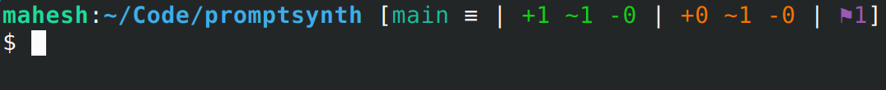
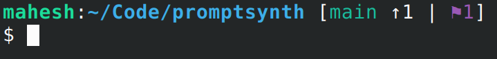

# `promptsynth`

An informative git prompt.

* It displays more information compared to most other git prompts. See screenshots below.

* It's a single executable written in C, and therefore can be used on any shell by calling it from `PS1` or equivalent.

* It's clutterless and to-the-point. (m.y s.u.b.j.e.c.t.i.v.e o.p.i.n.i.on)

## Screenshots
#### A git repo with some changes


_Meaning of symbols:_
* `+1 ~1 -0` (in green): One added file, one modified file and no deleted files are staged.
* `+0 ~0 -1` (in orange/yellow): one file is deleted and this is not yet staged.
* `≡`: This repo is even with origin branch.[^noremotecall]

#### A git repo with 1 unpushed commit and a stash entry


_Meaning of symbols:_
* `↑1`: Your local branch is one commit ahead of remote tracking branch, according to information stored in git.[^noremotecall]
* `⚑1`: There's a stash entry

## Installation

See "Build" section.

## Usage

run `promptsynth` from any directory. It will print the prompt if there's a git repo.

Yeah that's it.

You can invoke this command as part of your shell's `PS1`.

### Examples for popular shells:

#### ZSH:

```zsh
setopt prompt_subst
__NEWLINE=$'\n'
PS1='%B%F{blue}%n@%M%f %F{green}%~%f $(promptsynth)%b$__NEWLINE%# '
```

#### Bash:

```
PS1='\e[32;1m\H\e[0m:\e[34;1m\w\e[0m $(promptsynth)\n$ '
```

### Powershell

`TODO`

On powershell I'd recommend to use posh-git itself, which this project is inspired from.

### Customization

Some environment variables can be set to change the color. The values of color variables will be ANSI escape colors (eg: 31 for red, 32 for green etc...).

```bash
## Use bold colors in prompt printed. 0 (default) or 1.
PROMPTSYNTH_BOLD_COLORS=0

## Colors
export PROMPTSYNTH_BRANCHNAME_COLOR=36 #cyan
export PROMPTSYNTH_HASH_COLOR=36 # cyan, used when the detached head is checked out instead of branch
export PROMPTSYNTH_STAGED_COLOR=32 # green
export PROMPTSYNTH_UNSTAGED_COLOR=33 # yellow
export PROMPTSYNTH_REMOTE_STATUS_COLOR=37 # white
export PROMPTSYNTH_CONFLICT_COLOR=31 # red

## Misc
export PROMPTSYNTH_SHOW_STASH=0 # set to 1 to show the number of stash entries
export PROMPTSYNTH_CONFLICT_SYMBOL="?"
export PROMPTSYNTH_STASH_SYMBOL="⚑"
export PROMPTSYNTH_PROMPT_PREFIX="["
export PROMPTSYNTH_PROMPT_SUFFIX="]"
export PROMPTSYNTH_SEPARATOR="|"
```

## Build

```bash
git clone --recurse-submodules https://github.com/mahesh-hegde/promptsynth.git
cd promptsynth

## CMake build
mkdir build && cd build
cmake -DBUILD_SHARED_LIBS=0 -DUSE_SSH=0 -DUSE_HTTPS=0 -DUSE_THREADS=0 -DCMAKE_BUILD_TYPE=Release ..
cmake --build . --target promptsynth

## Install the resulting executable, eg:
mv promptsynth ~/.local/bin
```

### Running tests
Follow the above tests for building, then from build directory, build the test executable and run it.

```bash
cmake --build . --target promptsynth_test
./promptsynth_test
```

## Acknowledgement
* The functionality / prompt contents are almost same as [posh-git](https://github.com/dahlbyk/posh-git) module for Powershell.
* All git heavy lifting is done by [libgit2](https://github.com/libgit2/libgit2), which is vendored and statically linked.
* The flag symbol for stash entry is inspired by [bash-git-prompt](https://github.com/magicmonty/bash-git-prompt/).

[^noremotecall]: (this is based on locally stored information. `promptsynth` doesnt make any requests to remotes because such request may require authentication.).
